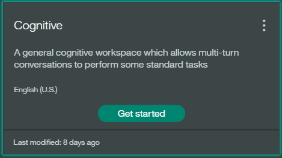

### Training the Conversation workspace

1. Navigate to your Bluemix console.

2. From the **All Services** section, click the Conversation service named `cognitive-conversation` in the **Services** list.

3. On the Service Details page, click the **Launch tool**.

4. You can start creating a new workspace for your application or import an existing workspace.

5. To import click **Import** in the Conversation service tool.

6. Specify the example cognitive workspace JSON file in the location:

  `<project_root>/training/cognitive-workspace.json`

7. Select **Everything (Intents, Entities, and Dialog)** and then click **Import**. The example cognitive workspace is created.

8. Click the menu icon in the upper-right corner of the workspace tile, and then select **View details**.

  

9. Click the  icon to copy the workspace ID to the clipboard.

10. Go to **Runtime** view in the application created and add the copied workspace ID as a new user defined environment variable named CONVERSATION_WORKSPACEID under the **Environment Variable** tab
